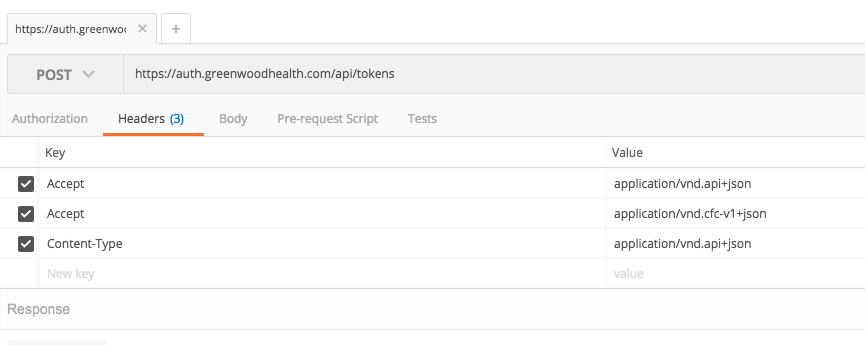
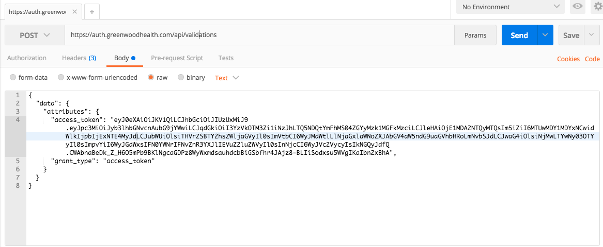

# LDAP OAuth2 Provider Init Script
An SSL-certified Docker container that translates LDAP/Active Directory logins to a valid <a href="https://jwt.io/" target="_blank">JWT</a>.

## Setup Instructions

1) Start with a Debian or Debian-based distro.
2) Make sure ports 80, 443, and 636 are available and open.
3) Install <a href="https://docs.docker.com/engine/installation/" target="_blank">Docker Engine</a> (Installation steps for Debian <a href="https://docs.docker.com/engine/installation/linux/debian/" target="_blank">here</a>).
4) Install <a href="https://docs.docker.com/compose/install/" target="_blank">Docker Compose</a> (Installation steps <a href="https://github.com/docker/compose/releases" target="_blank">here</a> ).
5) Install git (`apt-get install git`).
6) Navigate to your /var directory (`cd /var`).
7) Clone the repo into your /var directory (`git clone https://github.com/ConnectedforCare/ldap-oauth2-provider-init-script.git`).
8) `cd ldap-oauth2-provider-init-script`.
9) Gather the following settings requirements:

  - Hostname for your LDAP server. This must include a subdomain, domain, and top-level domain for the service to work properly (Ex: subdomain.domain.com).
  - The group on your LDAP server for the application to search within for user credentials. We recommend you create a custom group CN so you can easily add and remove users from our authentication service. For example, if the group you create in LDAP has a distinguishedName of CN=OAuthUsers,DC=domain,DC=tld, then here you would enter 'OAuthUsers'. Leave blank if not applicable.
  - An Active Directory dummy account distinguishedName. The OAuth2 Provider will use this to open up the connection with your LDAP server before attempting to authenticate with your actual users' credentials. We recommend creating a generic dummy account for this purpose. This should be the dummy account's full distinguishedName (Ex: CN=Joe Schmo,OU=DummyAccounts,DC=domain,DC=com).
  - The Active Directory account's corresponding password.
  - An admin email address--used to obtain an SSL certificate with <a href="https://letsencrypt.org/" target="_blank">Let's Encrypt</a>.
  - The external domain name associated with the server running this OAuth2 Provider. The SSL certificate will verify this domain.
  - A JSON Web Token secret. If another organization will be running the application that will be consuming this LDAP service, use the JWT secret they have provided. If you are consuming this LDAP service internally within your organization, generate a secret and add it to the application that will be consuming the LDAP service. This is needed to validate and refresh <a href="https://jwt.io/" target="_blank">JSON web tokens</a> (Ex: 8Dnq4ulBoQoG01PYJEB8I52kDZFfXyk6).

10) Run `sh setup.sh` and enter the required information.
11) It will take several minutes for the script to build the Docker container.
12) Once it's done, run this command to start up the container `/etc/init.d/LDAP-OAuth2-Provider start`. This will automatically start up the container and fetch its SSL certs. At any time, you can start, stop and restart this Docker container with the following commands:

- `/etc/init.d/LDAP-OAuth2-Provider start`
- `/etc/init.d/LDAP-OAuth2-Provider stop`
- `/etc/init.d/LDAP-OAuth2-Provider restart`

The Docker container will also restart automatically if your server reboots.

## How It Works

After you run setup.sh and enter your settings, the script will store your settings in 'settings.yml' inside the 'settings' folder. The script will also initialize files that will store your SSL certificates. It will then copy a script into your init.d directory that will automatically boot up the Docker container on system start.

Next, docker-compose.yml will build a Docker container based on the image declared in the Dockerfile, including automatically cloning, configuring and running <a href="https://github.com/ConnectedforCare/ldap-oauth2-provider.git" target="_blank">this application</a>.

Once all packages are installed on the container, starting the init.d script (`/etc/init.d/LDAP-OAuth2-Provider start`) will tell docker-compose to boot up the server.

The server will immediately fetch Let's Encrypt certs if necessary. It will also automatically renew the SSL certs after 60 days.

The application is now ready to authenticate username and password combinations as well as issue, validate, and refresh JSON Web Tokens as an OAuth2 provider.

## Confirming the Application Works
Once the OAuth2 server is running, you may want to test out the API endpoints. Here's how to do that.

1. Download [Postman](https://www.getpostman.com/) or another API client on your host machine


2. Inside Postman, enter your request url (https://<your-domain>/api/tokens) and change 'GET' to 'POST'


3. Click the 'Headers' tab, then set the following header types:

  * Accept: application/vnd.api+json
  * Accept: application/vnd.cfc-v1+json
  * Content-Type: application/vnd.api+json



4. To test auth token creation, click the 'Body' tab, select the 'raw' radio button, and enter your test request in the following format:

```
{
  "data": {
    "attributes": {
      "username": "<your-test-username-here>",
      "password": "<your-test-password-here>",
      "grant_type": "password"
    }
  }
}
```


Press the 'Send' button. It should return some nice JSON API-compliant JSON with tokens if username and password can be authenticated against your LDAP directory. Copy the access and refresh tokens for the coming tests.


5. To test auth token refreshing, copy the 'refresh-jwt' that was returned to you in the last request. Click the 'Body' tab again, select the 'raw' radio button, and enter your test request in the following format:

```
{
  "data": {
    "attributes": {
      "refresh_token": "<your-refresh-token-here>",
      "grant_type": "refresh_token"
    }
  }
}
```


After you press 'Send', it should return some JSON, including a new access token.


6. To test auth token validation, take one of the access tokens you received in the past requests. In the url bar, change the endpoint to 'https://<your-domain>/api/validations'. Change the method back to 'POST'. Click the 'Body' tab again, select the 'raw' radio button, and enter your test request in the following format:

```
{
  "data": {
    "attributes": {
      "access_token": "<your-access-token-here>",
      "grant_type": "access_token"
    }
  }
}
```



After you press 'Send', it should return some JSON, including whether or not the token was valid.


## API Documentation

This API has been documented with Swagger. View the entire API's endpoints, parameters, headers, responses and errors by doing the following:

1. <a href="http://swagger.io/docs/swagger-tools/#swagger-ui-documentation-29" target="_blank">Download and run Swagger UI</a>. This can easily be done by pull the swagger image and running it locally.
```
docker build -t swagger-ui-builder .
docker run -p 127.0.0.1:8080:8080 swagger-ui-builder
```

2. In your browser, go to localhost:8080

3. This brings up a dummy API. In the search bar in the top right, enter your API url and the path 'swagger_docs'. It should look like the following:
`https://<your-api-url>.com/swagger_docs`

4. Once you press 'Explore', your browser will pull up the interactive documentation for the API. Expand a header to view more information about the required parameters and responses.
